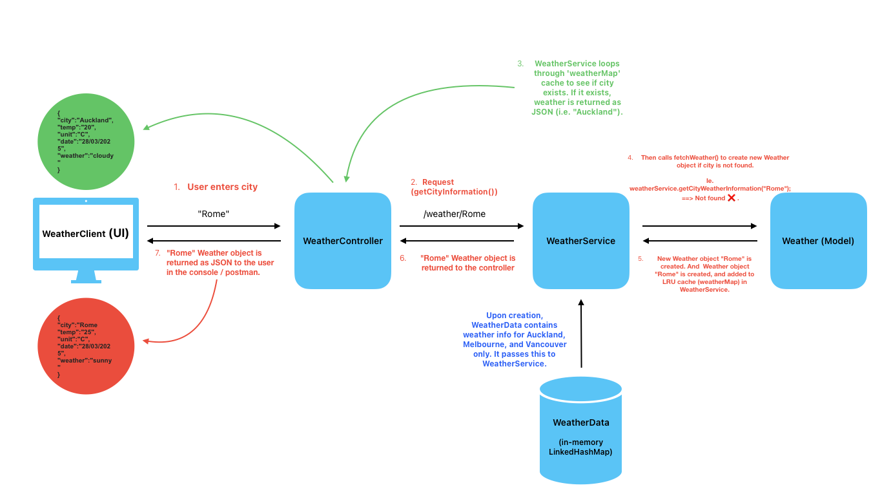
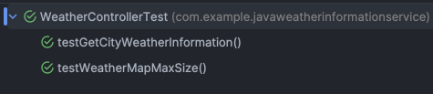
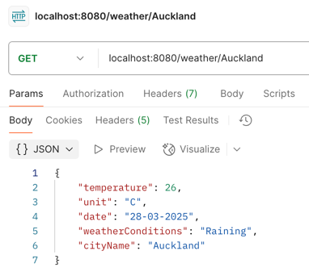
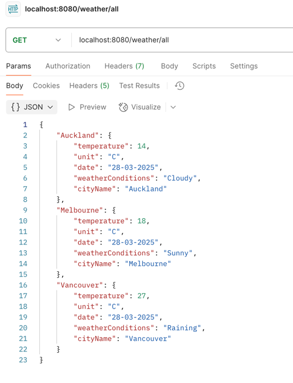
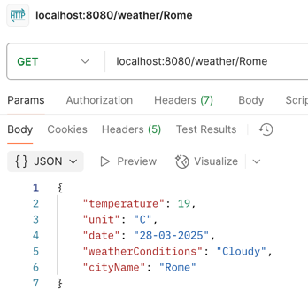

# Java Weather Application

This is a weather application that aims to mock an API for weather based on cities around the world. 

The structure of this project will be based on the Spring Boot Controller-Service-Repository pattern. There will be 
a User interface in the console that will allow a client/user to enter a city and receive weather information (in JSON) about that particular city. 

### Post Development breakdown
You will notice more pseudocode / comments throughout my code. Normally I wouldn't add as many comments as this, but 
I figured the documentation of my thought process behind using certain approaches / data structures would be helpful 
here.

## Architecture
I drafted this up in Freeform to hopefully visualise my thinking behind the structure of this project.

## Testing
For the sake of time, I chose not to mock bmy unit tests given this is a simple console application without complex 
dependencies. I've also mocked the API call for adding a new Weather Object, so no external APIs have been used. 

Unit tests added are passing at the time of submission:

### Postman API Calls are passing
`/weather/Auckland`

`/weather/all`

`/weather/Rome` - Retrieving a new city that isn't in-memory (i.e. Rome)

### Reasoning behind Spring Boot and Maven
Using Springboot and Maven, I built this application with efficiency, testability, and clean code in mind.

I chose to integrate Spring Boot within this project because I hadn't used it before and wanted the
exposure & learnings. Throughout development, it seemed that the [Spring Web MVC](https://docs.spring.
io/spring-framework/docs/3.2.x/spring-framework-reference/html/mvc.html) was the appropriate
framework for this
weather-api app, and I ultimately chose to use it based on the following passage:

>  ... the @Controller mechanism also allows you to create RESTful Websites and applications

The built-in support for REST APIs (i.e. using the @RestController and @GetMapping annotations) made creating and 
calling endpoints far easier.

I chose to use Maven since it's a popular Java build tool, and for its ability to easily manage and download
dependencies and configurations. Everything was all set up for me within the
`pom.xml`, which I liked. Another benefit was that I didn't have to worry about pesky `jar` files.